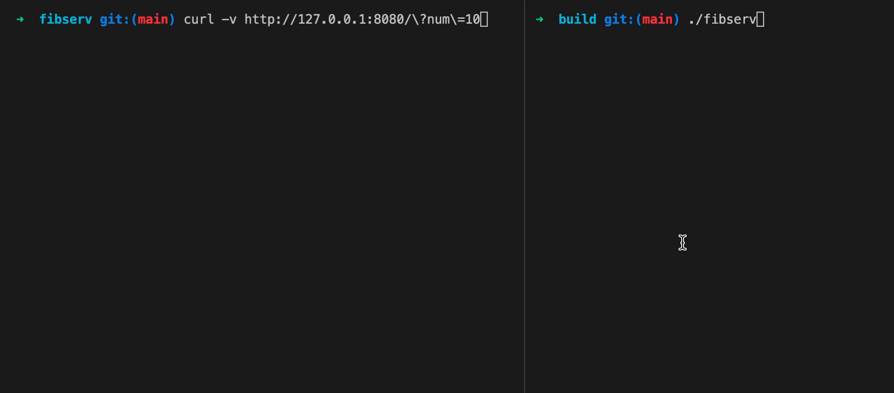
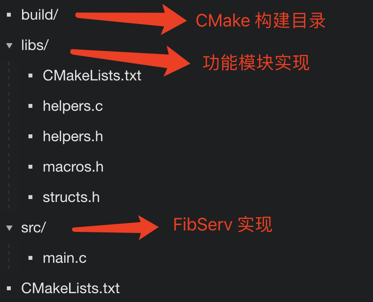

# 高性能http服务

## 这是一个怎样的项目？

俗话说得好，“有趣是第一生产力”。但似乎是从大学时代第一次接触 C 语言开始，就对使用这门语言开发的项目有了刻板印象，感觉它们不是枯燥的用户后台管理系统，就是各类晦涩的、与操作系统或硬件深入“绑定”的底层应用。但现实情况却并非如此。C 语言可以被广泛使用在应用软件、系统软件、编程语言、嵌入式开发等各类场景中。而这个项目，便是应用软件类目下服务器应用中的一种，“HTTP Server”。

Server 翻译过来即“服务器”，它在整个互联网世界中，主要用于接收由客户端发来的请求，并在处理之后返回相应结果。而 HTTP 服务器则将可处理的请求类型限定为了 “HTTP 请求”。这类服务器的稳定运行，支撑了日常生活中需要与互联网打交道的大多数事务。比如，每一次打开网页，都伴随着浏览器发出 HTTP 请求，服务器返回 HTTP 响应的过程。而这些返回的内容被浏览器渲染。

本次不会实现一个支持完整 HTTP 协议的服务器应用。将会带你实现一个名为 “HttpServ” 的程序。从理论的角度，来介绍应该如何使用 C 语言在 Linux 环境下实现它的主要功能。

HttpServ 在运行时可以接收形式为 “**/?num={pos}**” 的 GET 请求。其中，参数 num 对应的值 pos 为一个具体的整数。随后，程序会将该值作为一个索引信息，并返回斐波那契（Fibonacci）数列中对应该位置上的值。

可以参考下面这张动图，来观察程序的实际运行状态。



图片中包含有左右两个命令行窗口。在右侧窗口中，首先运行了 HttpServ。它会在当前计算机的 8080 端口上监听即将收到的 HTTP 请求。紧接着，在左侧窗口里，使用 curl 命令，向当前计算机（127.0.0.1）的 8080 端口发送了一个带有 “num=10” 参数的 GET 请求。经过一段时间，当 HttpServ 处理完该请求后，包含有结果值 “55” 的响应被传送回来。

可以看到 HttpServ 的功能十分简单。接下来就从方案设计的角度入手，来看应该如何实现它的主要功能。

## 如何使用 POSIX 接口实现 TCP Server？

实际上，HttpServ 的最核心功能便是对 HTTP 请求的接收与应答。在本项目将以 HTTP 1.1 标准作为实现要求。如下所示，根据 [RFC 7230](<https://www.rfc-editor.org/rfc/rfc7230.txt>) 对该标准的规定，HTTP 作为一种应用层协议，需要基于以传输层 TCP 协议建立的网络连接来实现。

> Although HTTP is independent of the transport protocol, the “http” scheme is specific to TCP-based services because the name delegation process depends on TCP for establishing authority.

在 Linux 系统中，借助套接字（Socket）接口，便能够建立这样的一个连接。这套接口属于 POSIX.1 标准的一部分，因此，它也同时被 Unix 与各种类 Unix 操作系统采用。套接字接口的全称一般为“套接字网络进程间通信接口”。从名称上就可以看出，通过这个接口，多个进程之间便可进行在同一网络下，甚至是跨不同网络的通信过程。对应到上面的动图，HttpServ 与 curl 之间的交互过程便是如此。

而**通过配合使用名为 socket、bind、listen、accept 以及 close 的五个接口，便能够完成 HttpServ 最核心的网络请求接收功能**。

其中，socket 接口用于创建套接字。套接字是一种用于描述通信端点的抽象实体，你可以这样简单理解：无论是客户端还是服务器，只要是能够参与到网络通信，并且可以进行数据传递的实体，它们都可以被抽象为一种特定类型的 socket 对象。

相应地，socket 接口暴露出了三个参数，用于指定这些不同对象在多个重要特征（通信域、套接字类型，及所使用的协议）上的不同。该接口的函数原型如下所示，接口在调用后会返回一个整型的文件描述符，以用于在后续代码中指代该 socket 资源。

```bash
int socket(
  int domain, 
  int type, 
  int protocol);
```

接下来，通过名为 bind 的接口，可以让套接字与一个具体的地址进行关联。通常来说，bind 被更多地用于为服务器类型端点对应的 socket 对象分配固定地址。这样，客户端便可通过这个地址来连接该服务器程序。

但需要注意的是，bind 接口使用的地址必须是在程序进程运行所在的计算机上有效的。在 HttpServ 的实现中，将直接使用本机地址 “127.0.0.1”。bind 接口在调用时共接收两部分信息，一部分为某个具体 socket 对象对应的文件描述符；另一部分为与所关联地址相关的数据结构。它的函数原型如下所示：

```bash
int bind(
  int sockfd, 
  const struct sockaddr *addr, 
  socklen_t addrlen);
```

此时，通过名为 listen 的接口，可以将一个 socket 对象变为“被动 socket”，也就是说，该 socket 会在某个地址上持续被动地等待从外部发来的连接请求，而不会自己主动发起连接。当该接口调用完毕后，所有 socket 接收到的连接请求都会被暂时存放到一个队列中，以等待下一步处理。

如下面的函数原型所示，listen 接口共接收两个参数，第一个参数为某个具体 socket 对象对应的文件描述符；第二个参数用于控制“暂存队列”的大小。当该队列发生溢出时，后续的连接请求将会被直接拒绝（ECONNREFUSED）。

```bash
int listen(int sockfd, int backlog);
```

最后，通过 accept 接口，可以从被动 socket 对应的暂存队列中依次取出已经到来的连接请求。这里，该接口会为每一个已接受的请求建立一个新的、表示已连接的 socket 对象。而在接下来的程序中，通过使用 read 与 write 等 IO 接口，便可直接使用该 socket，来读取出对应请求携带的数据，并同时将适当的结果返回给客户端。而若在调用 accept 接口时，暂存队列中没有待处理的连接请求，则接口调用者将会进入阻塞状态，直到下一个连接请求的到来。

通过下面的函数原型，可以看到该接口接收的参数与 bind 接口十分类似。

```bash
int accept(
  int sockfd, 
  struct sockaddr *restrict addr, 
  socklen_t *restrict addrlen);
```

与 IO 操作类似的是，当这个新创建的、对应于已接受连接的 socket 对象被使用完毕后，也需要通过 close 接口来关闭它所对应的文件描述符。在这个过程中，与该 socket 相关的系统资源会被清理，并且，对应的 TCP 连接也会被关闭。

```bash
int close(int fd);
```

至此，通过上面的几个简单步骤，便可成功实现一个基本的 TCP Server。这里你可以暂缓脚步，通过下面这张图片，来回顾一下上述实现流程。


TCP 协议主要规定了应该如何在通信双方之间，提供可靠和有序的数据流传输能力。因此，它并未对基于该连接传送的具体数据格式做任何要求和假设。而对这些传输字节流的解释，则由 TCP 连接双方根据应用层的具体协议来进行。在此基础上便能够进一步来实现 HTTP 协议。

## TCP 之上：HTTP 协议有何不同？

与 TCP 协议的复杂性比起来，HTTP 协议就相对简单很多。

在 HTTP 1.1 中，请求与响应的报文均是以纯文本的形式来在客户端与服务器之间传递的。这也就意味着，当 HttpServ 在处理一个 HTTP 请求时，实际上就是在处理这个请求对应的，一堆按照特定格式组织的 ASCII 字符。至于这些字符的具体内容，可以通过 read 接口，从已被接受的连接对应的 socket 对象中读取出来。

对 HttpServ 来说，一个正确的 HTTP 请求报文的格式可能如下所示：

```bash
GET /?num=10 HTTP/1.1
Host: 127.0.0.1:8080
User-Agent: ApacheBench/2.3
Accept: */*
```

整个报文被分为三部分，即**起始行、首部字段，以及主体**。其中，起始行中包含有与该请求相关的方法（GET）、路径（/?num=10），以及协议与版本（HTTP/1.1）信息。而首部字段中则包含所有的请求头信息，这些信息通常用于控制客户端或服务器应该如何处理该请求。对于某些属于特定方法的请求，报文中通常还可能包含有与请求一同发送过来的必要数据，这部分数据则被整理在了报文“最下方”的主体部分中。

如下所示，相应的 HTTP 响应报文也有着同样的三部分结构，只是起始行中包含的信息发生了变化：

```bash
HTTP/1.1 200 OK
Content-type: text/plain
Content-length: 2

55
```

这里的 “200” 和 “OK” 分别表示了该响应的状态码与可读状态信息。总的来看，请求报文的起始行描述了这个请求“希望要做的事情”；而响应报文的起始行则描述了“这件事做完后的结果状态”。与之前的请求报文不同，这个响应报文中还包含有主体部分的数据 “55”，而这部分数据便是从服务器返回的请求结果。

另外还值得一提的是，标准中规定，起始行和首部的每一行都需要以 CRLF，即“回车符”加“换行符”的形式结尾。而在首部字段与主体之间，则需要以 CRLF 结尾的一行空行进行分割。这是在代码中构建 HTTP 报文时需要注意的一点。

HTTP 1.1 除了对报文的具体格式做了详细规定外，它还对 TCP 连接控制、缓存管理、认证机制等其他重要功能的实现要求进行了说明。在本项目仅会对 HttpServ 收到的 HTTP 请求报文进行适当解析，并返回相应的响应报文。而在其他部分的实现上，可能并没有遵循 HTTP 协议的相关规定（比如默认情况下应使用长连接）。

## 会应用哪些优化策略？

为了尽可能提高 HttpServ 处理请求时的性能，将从几个很容易想到的地方入手，来对程序进行适当的优化。

### 简易线程池

首先来思考下：如何让程序充分利用多核 CPU 的多个处理单元？答案就是使用多线程。

在 HttpServ 的实现中，将为它构建一个拥有固定 N 个处理线程的简易线程池。其中，N 可以由用户在运行 HttpServ 时，通过添加额外的参数 “thread_count” 来指定。每一个线程在运行时，都会通过 accept 接口，独立地从 socket 对应的暂存队列中取出下一个待连接请求，并进行相应处理。通过这种方式，可以充分利用多个 CPU 核心，以让它们并行地处理多个请求。

### 尾递归调用

另一方面，对于斐波那契数列的计算函数，将分别提供它的正常递归版本与尾递归版本。通过这种方式能够明显地观察到尾递归优化带来的，可观的性能提升。
[24｜实战项目（下）：一个简单的高性能 HTTP Server【 微信号：itcodeba 】.md](..%2F..%2F..%2F..%2F..%2F..%2FDownloads%2F%E6%B7%B1%E5%85%A5%20C%20%E8%AF%AD%E8%A8%80%E5%92%8C%E7%A8%8B%E5%BA%8F%E8%BF%90%E8%A1%8C%E5%8E%9F%E7%90%86%2Fc%E5%B7%A5%E7%A8%8B%E5%AE%9E%E6%88%98%E7%AF%87%2F24%EF%BD%9C%E5%AE%9E%E6%88%98%E9%A1%B9%E7%9B%AE%EF%BC%88%E4%B8%8B%EF%BC%89%EF%BC%9A%E4%B8%80%E4%B8%AA%E7%AE%80%E5%8D%95%E7%9A%84%E9%AB%98%E6%80%A7%E8%83%BD%20HTTP%20Server%E3%80%90%20%E5%BE%AE%E4%BF%A1%E5%8F%B7%EF%BC%9Aitcodeba%20%E3%80%91.md)
### 避免忙等待

最后一个优化点虽然不会带来直观的性能改变，但对于理解“条件变量”在实际项目中的应用方式，却是十分有帮助的。

为了确保 HttpServ 能够在请求处理线程异常退出时，仍然保证线程池中的线程数量为 N，这里不会使用忙等待的方式持续判断存活的线程数量。相对地会使用条件变量，来让处理线程在退出时，及时通知主线程创建新的处理线程。而主线程也将在处理线程数量满足要求时，再次进入阻塞状态。

## 总结
要构建的是一个名为 HttpServ 的程序，该程序在运行时会扮演 HTTP 服务器的角色，并持续监听来自本地的 HTTP 请求。相应的请求需要为 GET 方法，并携带名为 “num” 的查询参数。HttpServ 在收到该类型请求后，会计算斐波那契数列中在对应位置上的项，并将该值返回给客户端。

在 Unix 与类 Unix 系统中，借助 POSIX.1 标准提供的五个接口，即 socket、bind、listen、accept 与 close，我们可以为程序实现监听并接收 TCP 连接请求的功能。而 HTTP 协议作为一种基于纯文本的应用层协议，可以在此基础上，在程序层面完成对请求报文的解析，以及响应报文的构建过程。

为了进一步提升 HttpServ 处理请求时的效率，还将为它提供了简易的线程池实现，以通过增加工作线程的方式，来进一步利用多核 CPU 的处理单元。同时，通过适当改写用于求取斐波那契数列的计算函数，编译器可以帮助我们将它的实现方式由递归优化为迭代，进而大幅提升运行性能。最后，借助条件变量，可以优化线程池在线程异常退出时的处理方式，让整个处理流程变得更加优雅。

通过注释的方式将这些代码的所在源文件标注出来。比如注释 “libs/structs.h#L9-L11”，便表示当前所示的代码段对应于项目 libs 目录下，structs.h 文件内的第 9 到 11 行。其他注释的含义你可以此类推。

## 编码
下面从基本的项目目录创建，到模块功能编写，再到代码编译和程序运行，一步步地完成整个项目的开发过程。

## 项目基本结构

看应该如何组织整个项目的目录结构。根据预估的项目体量，使用了如下图所示的目录结构：



这里，整个项目包含有三个目录：build、libs 以及 src。其中，build 目录用于存放程序在 CMake 下的临时编译结果。libs 目录中主要存放可以模块化的独立功能实现，这些功能会以头文件的形式来提供外部可用接口，以供不同的应用程序使用。而最后的 src 目录则存放有与应用程序  HttpServ 实现相关的源代码。

在此基础之上，会发现分别在 libs 目录与项目根目录下，同时创建了用于控制 CMake 编译流程的 CMakeLists.txt 文件。其中，前者主要用于控制 libs 目录内 C 源代码的编译流程；而后者则用于控制应用程序  HttpServ 的编译流程。

## 处理用户输入参数

HttpServ 在启动时可以接收一个由用户指定的，名为 “thread_count” 的参数。这个参数被用于控制  HttpServ 应启用多少线程来处理收到的 HTTP 请求。

这里专门封装了一个用于描述服务器整体配置状态的结构类型 serverSettings，其中仅有的 threadCount 字段便对应于该参数，代码如下：

```c++
// libs/structs.h#L9-L11
typedef struct {
  int threadCount;
} serverSettings;
```

而通过对 main 函数的两个参数 argc 与 argv 进行解析，能够得到用户在运行程序时传入的所有参数。在名为 setupServerSettings 的函数中，通过上述这种方式，完成了对用户传入参数的解析与保存过程，解析得到的所有合法选项均被存放在一个 serverSettings 类型的对象中。该函数的实现代码如下所示：

```c++
// libs/helpers.h#L67-L86
void setupServerSettings(int argc, const char** argv, serverSettings* ss) {
  while (argc-- > 1) {
    // process key.
    const char* keyHead = argv[argc];
    const char* keyPos = strchr(keyHead, '=');
    const size_t keyLen = keyPos - keyHead + 1;
    char key[keyLen];
    wrapStrFromPTR(key, keyLen, keyHead, keyPos);
    // process value.
    const char* valHead = keyHead + keyLen;
    const char* valPos = strchr(valHead, '\0');
    const size_t valLen = valPos - valHead + 1;
    char val[valLen];
    for (size_t i = 0; valHead <= valPos; valHead++)
      val[i++] = *valHead;
    if (strcmp(key, "thread_count") == 0) {
      ss->threadCount = atoi(val);
    }
  }
}
```

可以看到，通过判断 argc 的值是否大于 1（略过 argv 的第一个“程序文件名”参数），便能够对经由 argv 传递过来的输入参数进行遍历。每一次的遍历过程都分为两个步骤，即分别获取形如 “key=value” 的设置项的 key 与 value 两部分内容。

这里使用 C 标准库中的 strchr 函数，来得到每个选项中 “=” 与字符串结尾空字符 “\0” 的位置，并以此将整个选项分为两段。在此基础之上，通过分别收集这两个区间（首字符至 “=”，以及 “=” 至结尾空字符）内的字符，能够将一个选项的“键”与“值”进行拆分。最后，使用 strcmp 函数来比对所得到的键是否有效，若有效，则将相应的值存储到指定的 serverSettings 对象中。

至此， HttpServ 便完成了用户配置项的初始化工作。接下来继续为它实现 TCP Server 的核心功能。

## 实现 TCP Server

将使用来自 POSIX.1 标准的五个接口，socket、bind、listen、accept 与 close，来实现基本的 TCP 请求监听与连接创建等功能。

### 监听请求

为了将  HttpServ 接受和处理 HTTP 请求的代码抽离出来，以方便后续的多线程改造，这里将 TCP Server 的实现过程分为两个部分来介绍。

首先来看如何让程序进入“监听”状态，并持续等待 TCP 连接请求的到来。这部分代码将由 main 函数所在线程来执行，对应的代码如下所示：

```c++
// src/main.c#L70-95
int serverFd; 
sockaddr_in address;
int addrLen = sizeof(address);

// establish a socket.
if ((serverFd = socket(AF_INET, SOCK_STREAM, 0)) == 0) { ... }

bzero(&address, addrLen); 
address.sin_family = AF_INET;
address.sin_addr.s_addr = INADDR_ANY;  // -> 0.0.0.0.
address.sin_port = htons(PORT);
  
// assigns specified address to the socket.
if (bind(serverFd, (sockaddr*) &address, sizeof(address)) < 0) { ... }

// mark the socket as a passive socket.
if (listen(serverFd, MAX_LISTEN_CONN) < 0) { ... }
```

观察上述代码的第 7、15 与 18 行，你会发现，按顺序分别调用了接口 socket、bind 与 listen。其中，socket 接口共接收三个参数：AF_INET 宏常量表明使用 IPV4 因特网域；SOCK_STREAM 宏常量表明使用有序、可靠、双向，且面向连接的字节流；最后的参数 0 表明，让接口根据前两个参数自动选择使用的协议。当然，在这样的配置组合下，将默认使用 TCP 协议。

接下来，借助 bind 接口，我们可以为前一步创建的 socket 对象绑定一个地址。在 IPV4 域下，对应的地址用 sockaddr_in 类型的结构来表示。在代码的第 10~12 行，我们对该类型的一个对象 address 进行了初始化。其中，sin_addr 结构内的 s_addr 字段用于配置相应的地址信息。这里，INADDR_ANY 宏常量表示将 socket 绑定到地址 “0.0.0.0”。**通过这种方式，程序可以监听其运行所在的机器上发送到所有网卡（网络接口）的网络请求。**

另外需要注意的是为 address 对象设置用于表示网络端口的 sin_port 字段时，使用了名为 htons 的方法，来将一个 short 类型的端口值转换为**网络协议所要求字节序（通常为大端序）下的表示形式**。而之所以这样做，是为了让异构计算机在交换协议信息的过程中，不会被不同平台的不同字节序混淆。

紧接着，通过调用 listen 接口，程序开始监听即将到来的 TCP 连接请求。这里，通过它的第二个参数，指定了暂存队列最多能够存放的待连接请求个数为 MAX_LISTEN_CONN 个。

### 管理连接

到这里，程序便可以通过 accept 接口来不断地接受连接请求。此时，配合使用 read 和 write 这两个 IO 接口，可以获取客户端发来的数据，并在数据处理完毕后，再将特定内容返回给客户端。最后，当连接不再使用时，调用 close 接口即可将它关闭。关于这部分实现，可以参考文件 “src/main.c” 中第 36~39 行，以及第 60 行的代码。

## 处理 HTTP 请求和响应

当 TCP 连接成功建立后，便可在此基础之上进行与 HTTP 协议相关的操作，整个流程也十分简单，可以分为三个步骤：

1. 通过解析收到的 HTTP 请求报文，可以获取由客户端发送过来的参数值 num；
2. 调用斐波那契数列计算函数，相应的结果项可以被计算出来；
3. 通过构造一个合法的 HTTP 响应报文，可以将这个计算结果返回给客户端。

下面，来依次看看这几个步骤的具体实现。

### 解析请求

先来看第一步，解析请求。为了简化实现，这里将 HTTP 请求报文的解析过程分为了简单、直接的两个步骤，即**提取路径（URI）**和**解析查询参数值**。

当然，现实中的 HTTP 服务器应用通常会首先对报文的格式进行完整性校验，然后再进行类似的后续处理。与这部分逻辑相关的实现被封装在了名为 retrieveGETQueryIntValByKey 的函数中，它的实现代码如下所示：

```c++
// libs/helpers.c#L37-L65
int retrieveGETQueryIntValByKey(char* req, const char* key) {
  int result = 0;

  // extract uri;
  const char* uriHead = strchr(req, ' ') + 1;
  const char* uriTail = strchr(uriHead, ' ');
  size_t uriLen = uriTail - uriHead + 1;
  char strUri[uriLen];
  wrapStrFromPTR(strUri, uriLen, uriHead, uriTail);

  // parse uri;
  UriUriA uri;
  UriQueryListA* queryList;
  int itemCount;
  const char* errorPos;
  if (uriParseSingleUriA(&uri, strUri, &errorPos) == URI_SUCCESS) {
    if (uriDissectQueryMallocA(&queryList, &itemCount, uri.query.first, uri.query.afterLast) == URI_SUCCESS) {
      while (itemCount--) {
        if (strcmp(queryList->key, key) == 0) {
          result = atoi(queryList->value);
          break;
        }
        queryList = queryList->next;
      }
      uriFreeQueryListA(queryList);
    }
  }
  return result;
}
```

HTTP 请求报文的基本格式中，路径信息位于报文的“起始行”部分，而起始行中的每个元素则均以空格进行分割。因此，这里的第一步便是要**获取当整个报文从头向后逐字符遍历时，遇到的前两个空格之间的那段文本**。从代码中可以看到，这里再次使用了名为 strchr 的标准库函数来达到这个目的。

接下来，就会遇到“如何从路径文本中解析出给定查询参数的值？”这个棘手的问题。由于路径的形式可能有多种变化，比如未带有给定参数（/?foo=1）、带有除给定参数外的其他参数（/?foo=1&num=10）、带有子路径的参数（/child/?num=10），等等。因此，为了完善地处理这类情况，这里选用了一个开源的第三方 URI 解析库，uriparser。

uriparser 的使用方式十分简单，通过配合使用 uriParseSingleUriA 与 uriDissectQueryMallocA 这两个接口，可以将所传入 URI 的查询参数与值提取成一个单链表。而通过对它进行遍历（itemCount 表示参数个数），便能够找到目标参数的值。可以点击[这个链接](<https://github.com/uriparser/uriparser>)，来了解关于 uriparser 的更多信息。

### 计算斐波那契数列

此时，已经得到了由客户端通过 HTTP 请求传送过来的参数 num。而下一步要完成的，便是  HttpServ 的核心功能，即计算斐波那契数列第 num 项的值。与此相关的代码实现如下所示：

```c++
// libs/helpers.c#L8-L20
int __calcFibTCO(int n, int x, int y) {
  if (n == 0)
    return x;
  if (n == 1)
    return y;
  return __calcFibTCO(n - 1, y, x + y);
}

int __calcFibRecursion(int n) {
  if (n <= 1)
    return n;
  return __calcFibRecursion(n - 1) + __calcFibRecursion(n - 2);
}

int calcFibonacci(int n) {
  // return __calcFibTCO(n, 0, 1);  // TCO version. 
  return __calcFibRecursion(n);  // recursion version.
}
```

这里提供了两种不同的函数实现。其中，函数 __calcFibRecursion 为正常递归版本；而函数 __calcFibTCO 为对应的尾递归版本。由于这两个版本函数需要的参数个数不同，因此为了统一对外的调用接口，为外部代码又提供了另一个稳定接口 calcFibonacci，而该接口在内部则可根据需要动态调用上述的两种函数实现。

### 返回响应

当计算过程结束后，便可以构造 HTTP 响应报文，并将结果返回给客户端。**表示操作成功的响应报文应使用内容为 “HTTP/1.1 200 OK” 的响应头。**在本例中，没有返回任何首部字段，因此，响应头与主体之间可以直接使用以 CRLF 结尾的一行空行进行分割。关于这部分实现，可以参考文件 “src/main.c” 中第 55~56 行的代码。

## 整合多线程

经过上面几个步骤，已经可以让  HttpServ 正常地接收与处理 HTTP 请求，并返回包含有正确结果的 HTTP 响应。但为了进一步提升  HttpServ 的请求处理效率，将使用多线程技术来对它进行优化。

### 分离处理线程

首先，把请求处理相关的逻辑全部提取并封装在了名为 acceptConn 的函数中。这样，每一个线程便能够完全独立地来处理一个连接。该函数的完整实现代码如下所示：

```c++
noreturn void* acceptConn(void *arg) {
  acceptParams* ap = (acceptParams*) arg;
  int acceptedSocket;

  while (1) {
    pthread_cleanup_push(renewThread, &acceptedSocket);
    // extracts a request from the queue.
    if ((acceptedSocket = accept(ap->serverFd, ap->addr, ap->addrLen)) < 0) {
      perror("In accept");
      pthread_exit(NULL);
    }

    // deal with HTTP request.
    char reqBuf[HTTP_REQ_BUF];
    bzero(reqBuf, HTTP_REQ_BUF); 
    const size_t receivedBytes = read(acceptedSocket, reqBuf, HTTP_REQ_BUF);
    if (receivedBytes > 0) {
      char resBuf[HTTP_RES_BUF];

      // retrieve number from query.
      pthread_mutex_lock(&mutex);
      const int num = retrieveGETQueryIntValByKey(reqBuf, "num");
      pthread_mutex_unlock(&mutex);

      int fibResult = calcFibonacci(num);
      // follow the format of the http response.
      sprintf(resBuf, "HTTP/1.1 200 OK\r\n\r\n%d", fibResult);
      write(acceptedSocket, resBuf, strlen(resBuf));
    }
    close(acceptedSocket);
    pthread_cleanup_pop(0);
  }
}
```

为了能够在线程内部获取与 socket 相关的文件描述符、地址，以及地址长度信息，以便于后续 accept 等接口的调用，这里将这三个参数封装在了名为 acceptParams 的结构中。该结构的一个对象将在线程创建时以指针的形式传递进来，供所有处理线程使用。

在上述代码的第 5 行，通过一个死循环结构，线程便可持续不断地处理收到的连接请求。接下来，通过 accept 接口，可以从暂存队列中接受一个连接请求。代码的第 16 行，借助 read 函数，程序获取到了由客户端发送来的数据。这些数据将随着第 22 与 25 行的处理，最终变为需要的计算结果。最后，在代码的第 27~28 行，将该结果整合在一个 HTTP 响应报文中，并返回给客户端。

### 优雅地处理异常

除此之外，在代码的第 6 与 31 行，还调用了名为 pthread_cleanup_push 与 pthread_cleanup_pop 的两个函数。这两个函数的主要目的在于为线程添加退出时会自动执行的回调函数。这样便能够在线程由于 accept 调用失败而退出时，及时地通知主线程重新创建新的处理线程，以保证线程池中线程的数量维持在一个稳定状态。关于这两个函数的更详细用法，你可以点击[这个链接](<https://man7.org/linux/man-pages/man3/pthread_cleanup_push.3.html>)来了解。

但也正是因为需要对线程的状态进行更细致的管理，在本次实战项目中，并没有使用 C 标准中的线程库 threads.h，而是选用了 POSIX 标准下的 pthread 接口。但对于大多数的线程控制接口来说，两者只是在接口名称和使用方式上稍有差异，而背后的运行原理是完全一致的。

如下面的代码所示，在这个回调函数中，首先关闭了退出线程当前正在使用的 TCP 连接。接着，在互斥锁的保护下，更新了用于记录活动线程数量的全局变量 threadCounter，并通过 pthread_cond_signal 来通知 main 函数所在线程，重新创建处理线程。

```c++
void renewThread(void *arg) {  
  int* acceptedSocket = (int*) arg;
  close(*acceptedSocket);
  pthread_mutex_lock(&mutex);
  threadCounter--;
  pthread_cond_signal(&cond);  // notify main thread.
  pthread_mutex_unlock(&mutex);
} 
```

到这里，一切准备就绪。最后让回到 main 函数内部，将“命运的齿轮”转动起来。

### 创建线程

如下面的代码所示，位于 main 函数内的死循环结构主要用于不断地创建新的处理线程。可以看到，在代码的第 11~12 行，使用 pthread_create 接口创建新的线程，并同时递增了工作线程计数器，即全局变量 threadCounter 的值。而直到该值大于等于程序配置状态对象 serverSettings 中 threadCount 的值时，通过调用 pthread_cond_wait 接口，main 线程进入到了阻塞状态。这个状态将会一直维持，直至有工作线程发生异常退出。

```c++
// src/main.c#L97-L109
while (1) {
  pthread_mutex_lock(&mutex);
  while (threadCounter >= ss.threadCount)
    pthread_cond_wait(&cond, &mutex);
  pthread_mutex_unlock(&mutex);

  // create new thread to handle the request.
  pthread_t threadId;
  acceptParams ap = { serverFd, (sockaddr*) &address, (socklen_t*) &addrLen };
  pthread_create(&threadId, NULL, acceptConn, &ap);
  atomic_fetch_add(&threadCounter, 1);
  printf("[Info] Thread Created: No.%d\n", threadCounter);
}
```

到这里， HttpServ 在 C 代码层面的基本实现就结束了。接下来，将编写用于该项目的 CMake 配置文件，并尝试使用 cmake 命令对它进行编译。

## 编译与运行

在本项目中，将使用两个 CMakeLists.txt 文件，来分别控制 libs 目录内的源代码，以及  HttpServ 应用程序的编译过程。通过这种方式，CMake 会首先将前者编译为独立的 “.a” 静态库文件，然后再将该文件与 src 下的源代码一起编译，并生成最终的可执行文件。

libs 目录下的 CMakeLists.txt 文件内包含有以下内容：

```c++
# libs/CMakeLists.txt
aux_source_directory(. DIR_LIB_SRCS)
add_library(core STATIC ${DIR_LIB_SRCS})
```

其中，指令 aux_source_directory 用于收集当前目录下所有源文件的名称，并将这些名称存储到变量 DIR_LIB_SRCS 中。随后，通过 add_library 命令，从前一步收集而来的源文件将被一同编译，并生成名为 “core” 的静态库。

返回项目根目录，再来看用于控制应用程序  HttpServ 编译的 CMakeLists.txt 文件中的内容，具体如下所示：

```c++
cmake_minimum_required(VERSION 3.21)
project(mini-http-server)

set(TARGET_FILE "http-echo-server")
set(CMAKE_BUILD_TYPE Release)
set(CMAKE_C_STANDARD 17)

# a simple way to check non-standard C header files (includes the atomic-related one).
include(CheckIncludeFiles)
check_include_files("pthread.h;stdatomic.h;sys/socket.h;netinet/in.h;unistd.h" EDEPS)
if (EPTHREAD EQUAL 1)
  message(FATAL_ERROR "Necessary header files are not found!")
endif()

# for headers in "/libs" and other external installed packages.
include_directories(. /usr/local/include)

# load source files and sub-directories.
aux_source_directory(./src DIR_SRCS)
add_subdirectory(libs/)

# load packages.
find_package(uriparser 0.9.6 CONFIG REQUIRED char)

# for executable.
add_executable(${TARGET_FILE} ${DIR_SRCS})
target_link_libraries(${TARGET_FILE} PUBLIC core m pthread uriparser::uriparser)
```

其中，需要关注的是第 9~13 行的配置代码。这里，通过名为 check_include_files 的宏函数，能够让 CMake 在编译代码前，检测应用所需的指定头文件是否可以在当前环境下使用。若否，则直接终止项目的编译配置过程。

在接下来的第 16 行代码中，指定了程序编译时的头文件查找目录。通过第 19~20 行代码， HttpServ 对应实现的源文件，以及所需要的内部依赖项（core 静态库）被引用进来。在第 23 行，通过 find_package 指令，CMake 可以帮助查找程序需要使用的外部依赖包（这里即 uriparser）。

需要注意的是，uriparser 在可以被 CMake 正常使用之前，它需要被正确地编译和安装，你可以点击[这个链接](<https://github.com/uriparser/uriparser>)来查看更详细的说明。最后，通过 add_executable 与 target_link_libraries 两个指令，便可完成  HttpServ 二进制文件的编译和链接过程。

使用下面这行命令，可以一次性完成项目的编译前配置、代码编译与程序运行：

```c++
mkdir build && cd build && cmake .. && cmake --build . && ./ HttpServ
```


